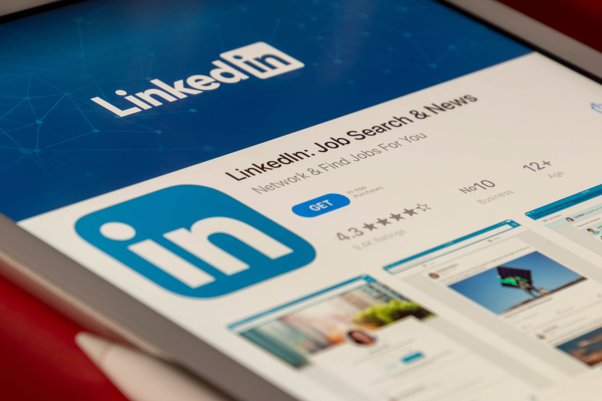
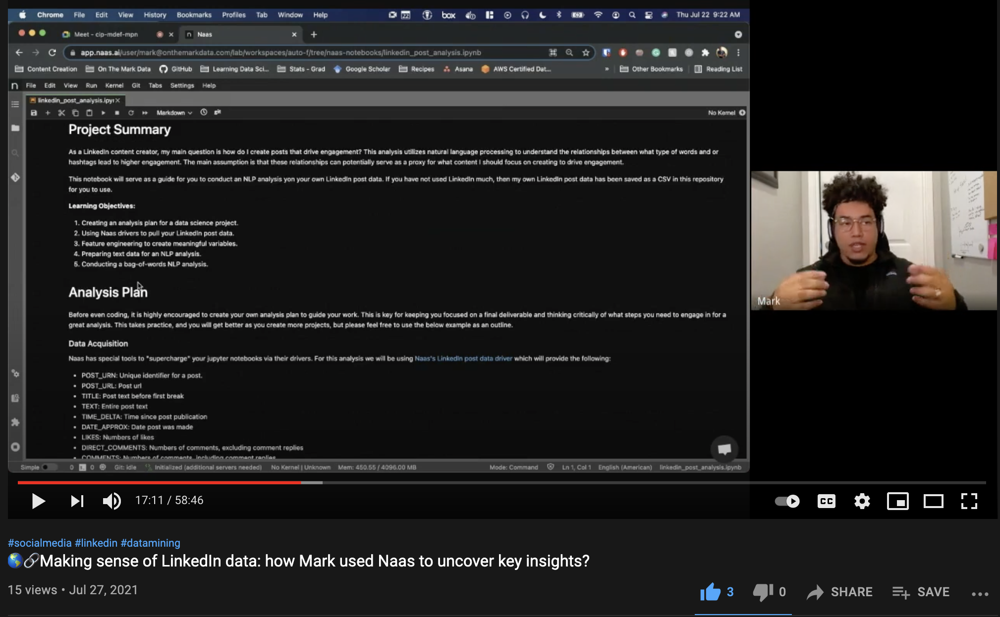
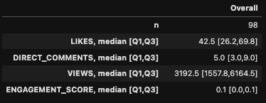
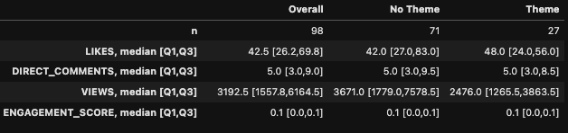
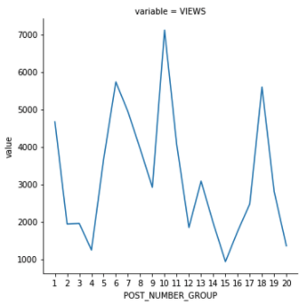
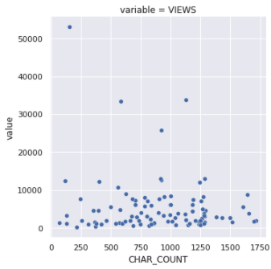
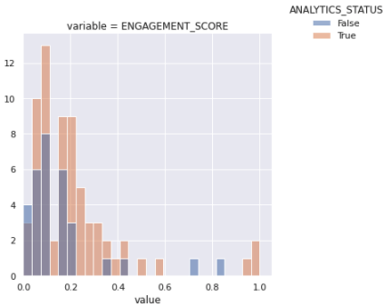
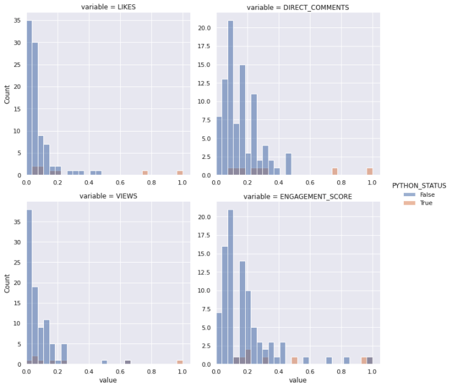

# 🌐 Part 1: LinkedIn Post Exploratory Analysis

  

Photo by <a href="https://unsplash.com/@rswebsols?utm_source=unsplash&utm_medium=referral&utm_content=creditCopyText">Souvik Banerjee</a> on <a href="https://unsplash.com/s/photos/linkedin?utm_source=unsplash&utm_medium=referral&utm_content=creditCopyText">Unsplash</a>

### 📓 Notebook With Tutorial:  
https://nbviewer.jupyter.org/github/mellamomark/linkedin-nlp-analysis/blob/master/linkedin_post_exploratory_analysis.ipynb

### 🔗 Interview With Naas AI On the Project

### 📝 Project Summary
As a LinkedIn content creator, my main question is how do I create posts that drive engagement? This analysis utilizes natural language processing to understand the relationships between what type of words and or hashtags lead to higher engagement. The main assumption is that these relationships can potentially serve as a proxy for what content I should focus on creating to drive engagement.

This notebook will serve as a guide for you to conduct an NLP analysis on your own LinkedIn post data. If you have not used LinkedIn much, then my own LinkedIn post data has been saved as a CSV in this repository for you to use.  

Finally, this notebook is mainly an exploratory analysis where there will be many instances where we can create a function or class to better organize our code. I have made the intentional choice to NOT create functions at this step to specifically mimic the iterative process of an exploratory analysis. In part two we will productize this notebook to send a weekly report to our email-- there we will identify what's important to move forward from the anlysis, refactor our code, and place emphasis on creating scalble and easy maintain code.

### 💡 Learning Objectives:
1. Creating an analysis plan for a data science project.
2. Using Naas drivers to pull your LinkedIn post data.
2. Feature engineering to create meaningful variables.
3. Preparing text data for an NLP analysis.
4. Conducting a bag-of-words NLP analysis.

### 🔬 Analysis Summary and Discussion
1. What are my overall summary statistics for my LinkedIn posts? 
    - On average, my posts generates ~42 likes, 5 direct comments, and ~3200 views.
        - 
  

2. Are higher views correlated higher with comments or like?
    - Comments and likes are unsurprisingly very much correlated with views, with likes being slightly more correlated than comments-- this analysis question was unfortunately not too useful.

3. Do links present in a post result in lower post views?
    - We were able to reject the null hypothesis for views, thus our data shows that having a link present in a post reduces the number of views.
    - Median Views Without Link: 3351 views
    - Median Views With Link: 856 views
    - It is important to note that the population with links was only 3 posts, thus I would more so see this as a data point to push for further research rather than a conclusion.

4. Did my weekday theme campaign (e.g. "#MondayMotivation", "#TuesdayTours", etc.) result in higher engagement?   
    - I found this question to be one of the most interesting as the results were unexpected.
    - Surprisingly, number of likes, direct comments, and the engagement score was the same for both population-- BUT views were drastically different.
        - 
  

    - The drastically different views were also confirmed by our ability reject the null hypothesis for views.
    - Furthermore, this drop in views was captured in my figure showing median views for every 5 posts.
        - Group 10 was right before I started my theme campaign.
        - Group 15 was near the end of my theme campaign.
        - 
  

    - How can a post have the same amount of engagement metrics but have drastically different views?
        - I reached out to other LinkedIn content creators and they provided anecdotal evidence that they also saw a massive drop in views after turning on a new LinkedIn feature called "Creator Mode".
        - This highlighted an unobserved covariate I did not account for, but interestingly my I turned on "Creator Mode" right when I started my theme campaign.
        - There is no way to show with this current analysis whether "Creator Mode" caused my views to drop, but regardless I find the correlation interesting and worth investigating further.

5. What are the main drivers of engagement on posts:  
    - Character count seems to be the most import feature for understanding our outcome variables.
    - When plotting character count against outcome variables, I was not impressed much as a trend did not seem to appear.
        - 
  

    - A potential next step would be to model some form of regression to better tease out these relationships (if any).
        - I imagine this wouldn't be too fruitful given our correlation heatmap shows a correlation of -0.13 between views and character count.

6. Are there any specific hashtags I should be using more to driving engagement?
    - Based on the feature importance I should consider "#analytics".
    - Yet when conducting the Mann Whitney U Test, I was only able to reject the null hypothesis for the engagement score.
        - 
  

    - Given hashtags don't reduce the reach of posts, I found the results to not be too informative.

7. Are there any specific content topics I should be posting more to drive engagement?
    - I believe this analysis is the most interesting and informative for my future post direction.
    - Among all the words within my posts's content, "python" showed the most feature importance.
    - Furthermore, when conducting the Mann Whitney U Test ALL outcome variables were able to reject the null hypothesis!
        - 
  

    - Moving forward, I will most likely create more LinkedIn content pertaining to python.
